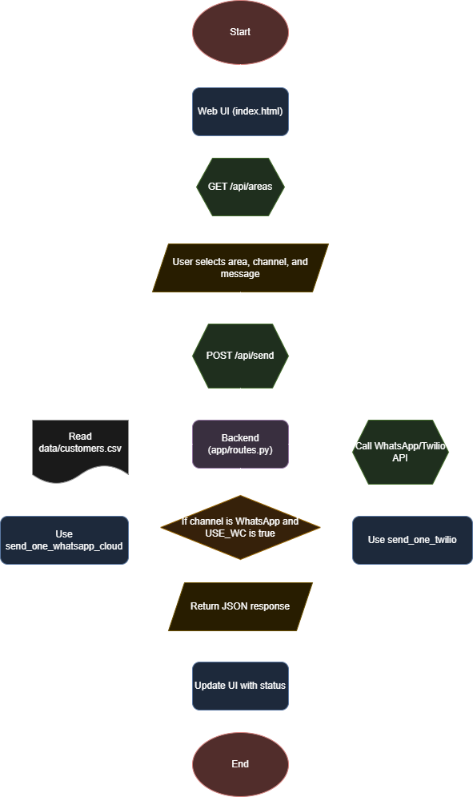

# KGM Cables Notification System

The KGM Cables Notification System is a simple, local web application designed for the owner of the KGM Cables television network. It provides a user-friendly interface to send bulk notifications to customers during a service outage.

## Project Structure

```
KGM_Cables/
├── app/                    # Main application folder
│   ├── __init__.py         # Initializes the app, creates the Flask app instance
│   └── routes.py           # Defines all backend API endpoints and business logic
├── data/
│   └── customers.csv       # Customer data file (name, phone, area)
├── static/
│   ├── css/
│   │   └── style.css       # Stylesheet for the web interface
│   └── js/
│       └── script.js       # Frontend logic for interactivity and API calls
├── templates/
│   └── index.html          # Main HTML page for the user interface
├── .env.example            # Example environment variables file
├── .gitignore              # Specifies files and directories for Git to ignore
├── pyproject.toml          # Project metadata and dependencies for uv
├── README.md               # This file
└── run.py                  # Main entry point to start the Flask application
```

## Flowchart

<div align="center">



*This flowchart illustrates the application's workflow, from user interaction to message delivery.* 

</div>

## Features

*   **Area-Based Targeting:** Allows the user to select a specific geographical area to send notifications to.
*   **Multi-Channel Messaging:** Enables the user to choose between sending notifications via SMS or WhatsApp.
*   **Customizable Messages:** Provides a text box with a default message template that the user can edit before sending.
*   **One-Click Sending:** A single "Send" button triggers the process of sending the message to all customers in the selected area.
*   **Status Feedback:** The UI provides clear feedback to the user (e.g., "Sending...", "Messages sent successfully," or "Error").

## Technology Stack

*   **Backend:** Python 3.9+ with Flask
*   **Frontend:** HTML5, CSS3, and "vanilla" JavaScript (ES6+)
*   **Data Processing:** Pandas
*   **Messaging API:** Twilio and WhatsApp Cloud API
*   **Package Management:** uv

## Setup and Installation

1.  **Clone the repository:**
    ```bash
    git clone https://github.com/your-username/KGM_Cables.git
    cd KGM_Cables
    ```

2.  **Create a virtual environment:**
    ```bash
    python -m venv .venv
    source .venv/bin/activate
    ```

3.  **Install the dependencies:**
    ```bash
    pip install uv
    uv pip sync
    ```

4.  **Create a `.env` file:**
    Create a `.env` file in the project root and add the following environment variables:

    ```
    # --- App ---

    CSV_PATH=data/customers.csv
    PORT=8501

    # --- WhatsApp Cloud API (Meta) ---

    WHATSAPP_CLOUD_TOKEN=YOUR_WHATSAPP_CLOUD_TOKEN
    WHATSAPP_CLOUD_PHONE_ID=YOUR_WHATSAPP_CLOUD_PHONE_ID
    WHATSAPP_CLOUD_API_VERSION=v20.0

    # --- Twilio --- (Optional)

    TWILIO_ACCOUNT_SID=YOUR_TWILIO_ACCOUNT_SID
    TWILIO_AUTH_TOKEN=YOUR_TWILIO_AUTH_TOKEN
    TWILIO_MESSAGING_SERVICE_SID=YOUR_TWILIO_MESSAGING_SERVICE_SID
    TWILIO_FROM_SMS=YOUR_TWILIO_FROM_SMS
    TWILIO_FROM_WHATSAPP=YOUR_TWILIO_FROM_WHATSAPP
    ```

5.  **Run the application:**
    ```bash
    python run.py
    ```
    The application will be available at `http://127.0.0.1:8501`.

## Usage

1.  Open your web browser and navigate to `http://127.0.0.1:8501`.
2.  Select an area from the dropdown menu.
3.  Choose a channel (SMS or WhatsApp).
4.  Edit the message in the text box.
5.  Click the "Send" button.

<div align="center">
  
**Author: Arunaggiri Pandian Karunanidhi**

</div>
